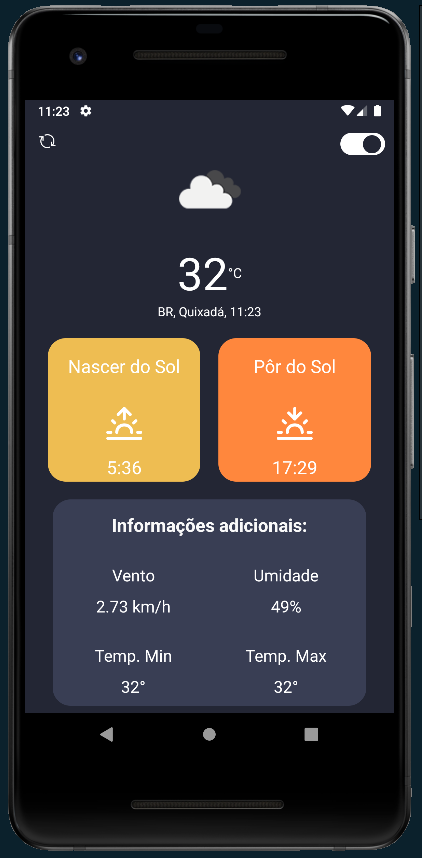

  

# weathehrApp

Aplicativo feito para verificar a temperatura de onde você está com base em sua localização.

## Stack utilizada

**REACT NATIVE**

## API

Utilizei a API do openWeather, link da documentação: https://openweathermap.org/api/one-call-3

## Funcionalidades

- Mostrar a temperatura atual.
- Localização e horário atual.
- Informações adicionais como: Velocidade do vento, Umidade, Temperatura máxima e mínima.
- Horário do nascer e pôr do sol.
- Switch de light e dark theme.

## Screenshots

- Light Theme

  

- Dark Theme

  

## Link para download

https://www.mediafire.com/file/78y1frmub0mlcx7/weatherApp.apk/file

## App não carrega?

Caso o App fique só carregando, é essencial que você esteja com a localização ligada e que permita o acesso. Depois entre no Google Maps para atualizar de fato a localização e abra o App novamente. Caso persista, entre em contato.

## Licença

[MIT](https://choosealicense.com/licenses/mit/)

## Autores

- [@audisiofilho](https://github.com/audisiofilho)
